# DevMethod: Agent System Evolution

## 🤖 Arquitectura del Sistema de Agentes

DevMethod evoluciona el sistema de agentes de BMAD Method, añadiendo especialización de Context Engineering de Cole Medin y rigor técnico de WIRASM-PRPS.

### Base: BMAD Method Agent System
**¿Por qué BMAD como base?**
- ✅ **Probado en producción**: 8+ agentes especializados funcionando
- ✅ **Workflow maduro**: Dual environment (Web UI → IDE) optimizado
- ✅ **Flexibilidad**: Expansion packs y configuración modular
- ✅ **Community**: Activamente mantenido y usado

### Evolución: DevMethod Enhancements
- ✅ **Context Engineering**: Multi-source research automation
- ✅ **Progressive Success**: Start simple → Validate → Enhance
- ✅ **Production-First**: Security, performance, monitoring built-in
- ✅ **Multi-Level Validation**: 4-level systematic validation

## 🎭 Core Development Team

### **1. ANALYST AGENT (Mary)**

#### Base BMAD Capabilities
```yaml
Name: Mary
Role: Business Analyst & Market Research
Core Commands:
  - "*create-project-brief": Comprehensive project documentation
  - "*brainstorm": Interactive brainstorming sessions
  - "*document-project": Brownfield project analysis
  - "*perform-market-research": Competitive analysis
```

#### DevMethod Enhancements
```yaml
Multi-Source Research Automation (Cole Medin):
  - "*research-auto": Automated competitive analysis
  - "*analyze-trends": Market trend analysis with AI
  - "*generate-insights": Data-driven business insights
  
Context Engineering Integration:
  - "*context-business": Business context dimension analysis
  - "*validate-personas": User persona validation
  - "*score-market-fit": Product-market fit scoring
  
Production-First Additions:
  - "*compliance-analysis": Regulatory requirements research
  - "*risk-assessment": Business risk identification
  - "*stakeholder-mapping": Stakeholder analysis and needs
```

#### Specialized Context Loading
```yaml
Always Loaded:
  - business-context.md
  - competitive-landscape.md  
  - regulatory-requirements.md
  - stakeholder-analysis.md

Context Engineering:
  - Multi-source gathering: Web research + Document analysis
  - Confidence scoring: 1-10 for research quality
  - Progressive refinement: Iterative insight improvement
```

---

### **2. PRODUCT MANAGER AGENT (John)**

#### Base BMAD Capabilities  
```yaml
Name: John
Role: Product Manager & Strategy
Core Commands:
  - "*create-prd": Product requirements document
  - "*create-brownfield-prd": Enhancement-focused PRD
  - "*shard-prd": Document sharding for development
  - "*prioritize-features": Feature prioritization
```

#### DevMethod Enhancements
```yaml
PRP Generation with Scoring (WIRASM + Cole):
  - "*create-prp-scored": PRP with confidence scoring (1-10)
  - "*optimize-context": Context density optimization
  - "*progressive-refine": Iterative PRP improvement
  - "*validate-completeness": 12-dimension context check
  
Production-Ready Planning:
  - "*plan-infrastructure": Infrastructure requirements
  - "*define-quality-gates": Quality and validation planning
  - "*estimate-resources": Resource and timeline planning
  - "*risk-mitigation": Risk planning and mitigation
```

#### Specialized Context Loading
```yaml
Always Loaded:
  - product-strategy.md
  - feature-specifications.md
  - quality-requirements.md
  - infrastructure-requirements.md

PRP Enhancements:
  - Context completeness: 190+/200 points required
  - Confidence scoring: 8+ required for development
  - Multi-level validation: Built into PRP structure
```

---

### **3. ARCHITECT AGENT (Winston)**

#### Base BMAD Capabilities
```yaml
Name: Winston  
Role: Solution Architect & System Design
Core Commands:
  - "*create-architecture": Technical architecture document
  - "*document-project": System analysis for brownfield
  - "*design-integration": Integration architecture
```

#### DevMethod Enhancements
```yaml
Production-First Architecture:
  - "*design-secure": Security-first architectural patterns
  - "*plan-scale": Scalability and performance architecture
  - "*validate-production": Production-readiness validation
  - "*optimize-infrastructure": Infrastructure optimization
  
Context Engineering Integration:
  - "*analyze-patterns": Existing codebase pattern analysis
  - "*recommend-stack": AI-powered technology recommendations
  - "*assess-complexity": Complexity and risk assessment
  - "*validate-decisions": Architectural decision validation
```

#### Specialized Context Loading
```yaml
Always Loaded:
  - architectural-patterns.md
  - security-requirements.md
  - performance-requirements.md
  - scalability-planning.md
  - technology-standards.md

Production Enhancements:
  - Security by design: OWASP compliance built-in
  - Performance budgets: Defined from architecture phase
  - Monitoring strategy: Observability architecture included
```

---

### **4. DEVELOPER AGENT (James)**

#### Base BMAD Capabilities
```yaml
Name: James
Role: Full Stack Developer
Core Responsibility: Story implementation and coding
Context Management: Clean context per story implementation
```

#### DevMethod Enhancements
```yaml
Progressive Implementation Pattern (Cole):
  - Start with MVP functionality
  - Validate each increment
  - Enhance iteratively
  - Continuous validation loops
  
Test-Driven Development:
  - Unit tests written first
  - Integration tests per story
  - Performance tests included
  - Security validation integrated
  
Quality-First Coding:
  - Code complexity limits enforced
  - Performance budgets respected
  - Security patterns applied
  - Documentation generated
```

#### Enhanced Context Loading
```yaml
Always Loaded:
  - coding-standards.md
  - tech-stack.md
  - ai-dev-guidelines.md
  - security-patterns.md (NEW)
  - performance-guidelines.md (NEW)
  - testing-standards.md (NEW)

DevMethod Additions:
  - Progressive implementation guides
  - Security-first coding patterns  
  - Performance optimization techniques
  - Test-driven development templates
```

---

### **5. QA AGENT (Quinn)**

#### Base BMAD Capabilities
```yaml
Name: Quinn
Role: Senior Developer & QA Specialist  
Core Commands:
  - "*review": Code review and improvement
  - Direct code improvement authority
  - Quality gate enforcement
```

#### DevMethod Enhancements
```yaml
Multi-Level Validation Execution:
  - "*validate-level-1": Syntax, style, complexity checks
  - "*validate-level-2": Unit test execution and coverage
  - "*validate-level-3": Integration test execution
  - "*validate-level-4": Production readiness validation
  
Security & Performance Testing:
  - "*security-scan": SAST/DAST execution and analysis
  - "*performance-test": Load and stress testing
  - "*compliance-check": Regulatory compliance validation
  - "*production-validation": Full production readiness
```

#### Specialized Context Loading
```yaml
Always Loaded:
  - quality-standards.md
  - testing-frameworks.md
  - security-checklist.md
  - performance-benchmarks.md
  - compliance-requirements.md

Validation Enhancements:
  - 4-level systematic validation
  - Automated security scanning
  - Performance validation with budgets
  - Compliance checking integrated
```

---

### **6. UX EXPERT AGENT (Sally)**

#### Base BMAD Capabilities
```yaml
Name: Sally
Role: UX Designer & Interface Expert
Core Commands:
  - "*create-front-end-spec": UI/UX specifications
  - "*generate-ui-prompt": Design prompts and guidelines
```

#### DevMethod Enhancements
```yaml
Accessibility-First Design:
  - "*design-accessible": WCAG AA compliance design
  - "*validate-usability": Usability testing and validation
  - "*optimize-performance": UI performance optimization
  - "*responsive-design": Multi-device design validation
  
User-Centered Design Process:
  - "*analyze-user-journey": User experience analysis
  - "*prototype-interactive": Interactive prototyping
  - "*test-accessibility": Accessibility validation
  - "*measure-ux-metrics": UX performance metrics
```

#### Specialized Context Loading
```yaml
Always Loaded:
  - design-system.md
  - accessibility-standards.md
  - user-personas.md
  - usability-guidelines.md

DevMethod Additions:
  - Accessibility-first design patterns
  - Performance-aware UI guidelines
  - User testing methodologies
  - Responsive design standards
```

---

### **7. PRODUCT OWNER AGENT (Sarah)**

#### Base BMAD Capabilities
```yaml
Name: Sarah
Role: Product Owner & Backlog Management
Core Commands:
  - "*execute-checklist-po": Product owner validation
  - "*shard-doc": Document sharding management
  - Backlog prioritization and story validation
```

#### DevMethod Enhancements
```yaml
Context-Driven Product Management:
  - "*validate-context": 12-dimension context validation
  - "*prioritize-production": Production-ready feature prioritization
  - "*manage-technical-debt": Technical debt tracking and planning
  - "*coordinate-release": Release planning and coordination
  
Stakeholder & Quality Management:
  - "*stakeholder-review": Stakeholder validation processes
  - "*quality-acceptance": Quality gate acceptance criteria
  - "*risk-management": Product risk identification and mitigation
```

#### Specialized Context Loading
```yaml
Always Loaded:
  - product-backlog.md
  - stakeholder-requirements.md
  - quality-criteria.md
  - release-planning.md

Enhanced Responsibilities:
  - Context completeness validation (190+ points)
  - Production readiness oversight
  - Cross-functional coordination
  - Quality gate enforcement
```

---

### **8. SCRUM MASTER AGENT (Bob)**

#### Base BMAD Capabilities
```yaml
Name: Bob
Role: Scrum Master & Story Creation
Core Commands:
  - "*draft": Story creation and drafting
  - "*correct-course": Process improvement and adjustment
  - Story breakdown and sprint planning
```

#### DevMethod Enhancements
```yaml
Progressive Story Development:
  - "*create-progressive": Progressive story creation (MVP → Enhanced)
  - "*validate-story": Story validation against context
  - "*estimate-complexity": Story complexity estimation
  - "*plan-validation": Validation planning per story
  
Process & Quality Management:
  - "*coordinate-agents": Multi-agent workflow coordination
  - "*track-progress": Progress tracking and reporting
  - "*manage-blockers": Blocker identification and resolution
  - "*facilitate-retrospective": Process improvement facilitation
```

#### Specialized Context Loading
```yaml
Always Loaded:
  - story-templates.md
  - estimation-guidelines.md
  - workflow-standards.md
  - progress-tracking.md

DevMethod Additions:
  - Progressive story templates
  - Multi-level validation integration
  - Context-driven story creation
  - Production-ready acceptance criteria
```

## 🎛️ Meta Agents

### **DEVMETHOD-ORCHESTRATOR**
```yaml
Evolution_of: bmad-orchestrator
Enhanced_Capabilities:
  - Context optimization algorithm
  - Parallel agent coordination
  - Resource allocation intelligence
  - Multi-environment workflow management

Specialized Functions:
  - "*orchestrate-context": 12-dimension context gathering
  - "*coordinate-validation": Multi-level validation coordination
  - "*optimize-workflow": Workflow optimization across agents
  - "*manage-handoffs": Clean context handoffs between agents
```

### **DEVMETHOD-MASTER**
```yaml
Evolution_of: bmad-master
Enhanced_Capabilities:
  - All specialized agent capabilities
  - Context switching optimization
  - Meta-learning from interactions
  - Production-ready decision making

When to Use:
  - Complex architectural decisions
  - Cross-cutting concern analysis
  - Emergency problem resolution
  - High-level strategy validation

When NOT to Use:
  - Regular story implementation (use Dev)
  - Routine code reviews (use QA)
  - Standard story creation (use SM)
```

## 🔄 Agent Workflow Integration

### **Context Engineering Flow**

```mermaid
graph TD
    A[Context Gathering] --> B[Analyst: Research Auto]
    B --> C[PM: PRP Generation]
    C --> D[Architect: Production Design]
    D --> E[PO: Validation]
    E --> F{Score ≥ 190?}
    F -->|No| B
    F -->|Yes| G[Development Phase]
```


### **Development Flow**


### **Agent Communication Protocol**
```yaml
Context_Handoffs:
  - Clean context per agent interaction
  - Specific context loading per agent role
  - Progressive context building across phases
  - Context validation at each handoff

Quality_Gates:
  - Each agent validates input context
  - Output validation before handoff
  - Confidence scoring maintained
  - Quality metrics tracked
```

## 📊 Agent Performance Metrics

### **Individual Agent Metrics**
```yaml
Context_Quality:
  - Context completeness score
  - Information density ratio
  - Specificity vs generality ratio
  
Output_Quality:
  - Confidence scoring (1-10)
  - Validation pass rate
  - Iteration cycles required
  
Efficiency:
  - Time to complete tasks
  - Context switches required
  - Handoff success rate
```

### **System-Wide Metrics**
```yaml
Workflow_Efficiency:
  - End-to-end delivery time
  - Rework cycles required
  - Quality gate pass rate
  
Production_Readiness:
  - Security validation pass rate
  - Performance benchmark achievement
  - Compliance requirement coverage
```

---

**El Agent System de DevMethod proporciona especialización profunda, context engineering sistemático, y production-ready development desde el primer día.**