# DevMethod: Unified Workflow

## 🎯 Arquitectura del Workflow

DevMethod combina el **dual environment** de BMAD, el **progressive success pattern** de Cole Medin, y los **validation loops** de WIRASM-PRPS en un workflow unificado optimizado para production-ready development.

### Filosofía del Workflow
> **"Context-Driven → Research-Automated → Progressive-Validated → Production-Ready"**

- **Context-First**: No development sin contexto completo (190+ puntos)
- **Research-Automated**: Multi-source intelligence gathering
- **Progressive-Success**: Start simple → Validate → Enhance → Repeat
- **Production-Ready**: Security, performance, monitoring desde día 1

## 🔄 Workflow Overview

```mermaid
graph TD
    A[Start Project] --> B[Context Gathering<br/>12 Dimensions]
    B --> C{Score ≥ 190/200?}
    C -->|No| B
    C -->|Yes| D[Research Automation<br/>Multi-source]
    D --> E[PRP Generation<br/>Cole Scoring]
    E --> F{Confidence ≥ 8/10?}
    F -->|No| D
    F -->|Yes| G[Architecture Design<br/>Production-First]
    G --> H[Document Sharding<br/>BMAD Method]
    H --> I[Development Phase<br/>Progressive + Validated]
    I --> J[Production Deployment<br/>Level 4 Validated]
    J --> K[Monitor & Iterate]
    K --> L{New Feature?}
    L -->|Yes| D
    L -->|No| M[Project Complete]
```



## 📋 FASE 1: FOUNDATION (Web UI Optimizada)

### **Duración**: 2-4 horas  
### **Herramientas**: Gemini/Claude Web UI (costo-efectivo para contexto masivo)
### **Objetivo**: Establecer foundation sólida antes de development

#### **1.1 Context Gathering (12 Dimensiones)**
```yaml
Process:
  1. Use template: /templates/context-gathering-template.md
  2. Complete all 12 dimensions systematically
  3. Real-time scoring with /scripts/devmethod-context-scorer.sh
  4. Iterate until minimum 190/200 points achieved
  
Quality_Gates:
  - Information density >0.7 (70% specific content)
  - Specificity ratio >2.0 (2x specific vs generic)
  - Actionability score >0.8 (80% actionable items)
  - Completeness index 1.0 (100% required fields)
  
Automation_Support:
  - Real-time scoring feedback
  - Gap identification with recommendations
  - Progress tracking with visual indicators
  - Context validation against best practices

Success_Criteria:
  ✅ Context score ≥ 190/200 points
  ✅ All 12 dimensions substantially complete
  ✅ Quality metrics meet thresholds
  ✅ Stakeholder validation completed
```

#### **1.2 Research Automation (Cole Medin Method)**
```yaml
Multi-Source_Research:
  Competitive_Analysis:
    - Automated competitive intelligence gathering
    - Feature comparison matrices
    - Pricing and positioning analysis
    - User review sentiment analysis
    
  Technical_Research:
    - Stack Overflow trend analysis
    - GitHub repository analysis
    - Documentation quality assessment
    - Community support evaluation
    
  Market_Research:
    - Industry trend analysis
    - User behavior pattern research
    - Technology adoption curves
    - Risk and opportunity identification

Agent_Execution:
  Primary: /analyst → *research-auto
  Support: /pm → *analyze-trends
  Validation: /architect → *assess-complexity
  
Automation_Tools:
  - /scripts/devmethod-research-auto.sh
  - Multi-source data aggregation
  - AI-powered insight generation
  - Automated research report creation

Success_Criteria:
  ✅ Multi-source research completed (≥3 sources per area)
  ✅ Competitive landscape mapped
  ✅ Technical risks identified
  ✅ Market opportunities validated
```

#### **1.3 PRP Generation (WIRASM + Cole Scoring)**
```yaml
PRP_Structure: # WIRASM-PRPS Foundation
  Goal: Specific end state and objectives
  Why: Business value and user impact
  What: Visible user behavior and technical requirements
  Context: All needed context for implementation
  Blueprint: Step-by-step implementation plan
  Validation: Multi-level validation strategy
  
Cole_Enhancements:
  Confidence_Scoring: 1-10 scale based on:
    - Context completeness (40% weight)
    - Research depth (30% weight)  
    - Technical clarity (30% weight)
    
  Progressive_Structure:
    - MVP definition (minimum viable)
    - Enhancement phases (iterative improvement)
    - Success metrics (measurable outcomes)
    - Risk mitigation (contingency planning)

Agent_Execution:
  Primary: /pm → *create-prp-scored
  Research: /analyst → Context and market intelligence
  Technical: /architect → Technical architecture input
  Validation: /po → Requirements validation
  
Automation_Support:
  - /scripts/devmethod-prp-generator.sh
  - Template-driven PRP creation
  - Automated confidence scoring
  - Gap identification and recommendations

Success_Criteria:
  ✅ PRP confidence score ≥ 8/10
  ✅ All WIRASM-PRPS sections complete
  ✅ Progressive enhancement plan defined
  ✅ Stakeholder approval obtained
```

#### **1.4 Architecture Design (Production-First)**
```yaml
Production-First_Architecture:
  Security_by_Design:
    - OWASP Top 10 mitigation built-in
    - Authentication/authorization architecture
    - Data encryption and protection strategy
    - Security monitoring and alerting
    
  Performance_by_Design:
    - Performance budgets defined
    - Caching strategy architected
    - Database optimization planned
    - Monitoring and observability strategy
    
  Scale_by_Design:
    - Horizontal scaling architecture
    - Load balancing strategy
    - Database scaling plan
    - CDN and edge optimization

Agent_Execution:
  Primary: /architect → *design-secure, *plan-scale
  Validation: /qa → *validate-production
  Input: /pm → Requirements and constraints
  Review: /po → Stakeholder validation
  
DevMethod_Enhancements:
  - Infrastructure as Code planning
  - CI/CD pipeline architecture
  - Disaster recovery planning
  - Compliance requirement integration

Success_Criteria:
  ✅ Production-ready architecture documented
  ✅ Security, performance, scale considerations integrated
  ✅ Infrastructure and deployment strategy defined
  ✅ Architecture review passed
```

#### **1.5 Foundation Validation**
```yaml
Validation_Checklist: # Based on BMAD po-master-checklist
  Context_Validation:
    ✅ Context score ≥ 190/200
    ✅ All stakeholders reviewed and approved
    ✅ Business case validated and signed-off
    ✅ Compliance requirements identified
    
  Research_Validation:
    ✅ Competitive analysis complete
    ✅ Technical risks identified and mitigated
    ✅ Market opportunity validated
    ✅ User research synthesized
    
  PRP_Validation:
    ✅ PRP confidence ≥ 8/10
    ✅ All requirements clear and actionable
    ✅ Success metrics defined
    ✅ Progressive plan approved
    
  Architecture_Validation:
    ✅ Production readiness confirmed
    ✅ Security architecture approved
    ✅ Performance budgets defined
    ✅ Infrastructure plan complete

Agent_Execution: /po → *execute-checklist-po
Final_Approval: Product Owner + Stakeholder sign-off
```

---

## 🏗️ FASE 2: DEVELOPMENT (IDE Optimizada)

### **Duración**: Variable por proyecto
### **Herramientas**: Claude Code, Cursor, Windsurf (file operations optimizadas)
### **Objetivo**: Progressive implementation con continuous validation

#### **2.1 Document Sharding (BMAD Method)**
```yaml
Sharding_Process: # BMAD proven approach
  Automatic_Sharding:
    - Use md-tree explode for large documents
    - Level 2 headings become separate files
    - Maintain document index and navigation
    - Preserve context and formatting
    
  Manual_Sharding: # If automatic fails
    - /po → *shard-doc for systematic sharding
    - Create docs/prd/ and docs/architecture/
    - Break into manageable sections (<2000 words)
    - Maintain cross-references and links

Document_Structure:
  docs/prd/: Product requirements sharded
  docs/architecture/: Technical architecture sharded  
  docs/stories/: User stories and acceptance criteria
  docs/validation/: Testing and quality requirements
  
Agent_Execution: /po → Document organization and sharding
Automation: /scripts/devmethod-doc-sharder.sh

Success_Criteria:
  ✅ All documents properly sharded
  ✅ Document index maintains navigation
  ✅ Context preserved across shards
  ✅ Development team can access relevant sections
```

#### **2.2 Progressive Story Development**
```yaml
Story_Creation_Cycle: # BMAD + Cole Progressive Pattern
  
  NEW_CHAT → SM_Story_Creation:
    Agent: /sm → *create-progressive
    Input: Epic from sharded PRP
    Output: Progressive story (MVP → Enhanced phases)
    Template: /templates/progressive-story-template.md
    
  User_Validation:
    Review: Story completeness and clarity
    Approval: Move from Draft → Approved status
    Feedback: Iteration if needed
    
  NEW_CHAT → DEV_Implementation:
    Agent: /dev → Implementation with context loading
    Context: Story + Architecture shards + Always files
    Pattern: Progressive (MVP first, enhance iteratively)
    Validation: Level 1-2 validation per increment
    
  NEW_CHAT → QA_Review:
    Agent: /qa → *review + multi-level validation
    Scope: Code review + Level 3-4 validation
    Authority: Direct code improvement allowed
    Output: Binary approval (Done vs Changes Required)

Progressive_Implementation_Pattern:
  Phase_1_MVP:
    - Core functionality only
    - Basic error handling
    - Essential tests
    - Security basics
    
  Phase_2_Enhanced:
    - Performance optimization
    - Advanced error handling
    - Comprehensive testing
    - Advanced security features
    
  Phase_3_Production:
    - Monitoring integration
    - Documentation completion
    - Performance tuning
    - Security hardening
```

#### **2.3 Multi-Level Validation (Per Story)**
```yaml
Level_1_Validation: # Immediate (per commit)
  Automated_Checks:
    - Syntax and style validation
    - Complexity limits enforcement  
    - Security static analysis
    - Dependency vulnerability scanning
    
  Tools: ESLint, Prettier, SonarQube, Snyk
  Trigger: Pre-commit hooks
  Time: <2 minutes
  
Level_2_Validation: # Per story completion
  Testing_Requirements:
    - Unit test coverage ≥80%
    - Performance budget compliance
    - Error condition testing
    - Mock usage validation
    
  Tools: Jest/Vitest, Coverage tools, Performance monitors
  Trigger: Story completion
  Time: <10 minutes
  
Level_3_Validation: # Per epic completion
  Integration_Testing:
    - API contract validation
    - Database integration testing
    - External service integration
    - End-to-end workflow testing
    
  Tools: Cypress/Playwright, API testing tools, Database tests
  Trigger: Epic completion
  Time: <30 minutes
  
Level_4_Validation: # Pre-production
  Production_Readiness:
    - Security scanning (SAST/DAST)
    - Load testing and stress testing
    - Compliance validation
    - Operational readiness check
    
  Tools: OWASP ZAP, K6/JMeter, Compliance scanners
  Trigger: Release candidate
  Time: <2 hours

Validation_Automation:
  - /scripts/devmethod-validator.sh --level [1-4]
  - Continuous integration pipeline integration
  - Automated reporting and alerting
  - Quality gate enforcement
```

#### **2.4 Context Management (BMAD Principles)**
```yaml
Clean_Context_Principle: # Critical BMAD practice
  Agent_Isolation:
    - NEW CHAT between SM → Dev → QA
    - Each agent loads only relevant context
    - No context contamination between roles
    - Specific context per agent specialization
    
  Context_Loading_Per_Agent:
    SM_Context: Epic + Story templates + Process guidelines
    Dev_Context: Story + Architecture + Coding standards + Always files
    QA_Context: Story + Test requirements + Quality standards
    
  Context_Always_Files: # Loaded for every Dev interaction
    - docs/architecture/coding-standards.md
    - docs/architecture/tech-stack.md  
    - docs/architecture/ai-dev-guidelines.md
    - docs/security/security-patterns.md
    - docs/performance/performance-guidelines.md
    - docs/testing/testing-standards.md

Progress_Tracking:
  Story_Status: Draft → Approved → InProgress → Review → Done
  Task_Tracking: [ ], [-], [x] markdown checkboxes
  File_Lists: Dev maintains list of files modified
  Completion_Notes: Deviations and decisions documented
```

---

## 🚀 FASE 3: DEPLOYMENT (Production-Ready)

### **Duración**: Automatizada (minutos a horas)
### **Herramientas**: CI/CD pipelines, Infrastructure as Code
### **Objetivo**: Zero-downtime production deployment

#### **3.1 Pre-Deployment Validation**
```yaml
Final_Quality_Gates:
  Level_4_Validation_Complete:
    ✅ Security scans passed (SAST/DAST clean)
    ✅ Performance tests passed (load/stress)
    ✅ Compliance validation passed
    ✅ Operational readiness confirmed
    
  Production_Checklist:
    ✅ Infrastructure as Code deployed
    ✅ Monitoring and alerting configured
    ✅ Backup and disaster recovery tested
    ✅ Rollback plan verified
    ✅ Support documentation complete
    
Automation: /scripts/devmethod-deploy-pipeline.sh
Validation: Automated quality gates + manual approval
```

#### **3.2 Deployment Execution**
```yaml
Deployment_Strategy: # Based on project requirements
  Blue_Green: Zero downtime, instant rollback
  Canary: Gradual rollout with monitoring
  Rolling: Progressive deployment with validation
  
CI_CD_Pipeline:
  1. Final validation execution
  2. Infrastructure provisioning
  3. Application deployment
  4. Health check validation
  5. Traffic routing
  6. Monitoring activation
  
Rollback_Capability:
  - Automatic rollback on failure detection
  - Manual rollback within 5 minutes
  - Data consistency preservation
  - Service continuity maintained
```

#### **3.3 Post-Deployment Monitoring**
```yaml
Immediate_Monitoring: # First 24 hours
  - Application performance metrics
  - Error rate and response time monitoring
  - User behavior and adoption tracking
  - Infrastructure health monitoring
  
Long_Term_Monitoring:
  - Business metric tracking
  - User satisfaction monitoring
  - Performance trend analysis  
  - Security incident monitoring
  
Alerting_Strategy:
  - Critical issues: Immediate notification
  - Performance degradation: 5-minute notification
  - Business metric changes: Daily reports
  - Security events: Immediate escalation
```

---

## 🔄 FASE 4: ITERATION & IMPROVEMENT

### **Objective**: Continuous improvement and feature enhancement

#### **4.1 Post-Launch Review**
```yaml
Success_Metrics_Review:
  Business_Metrics:
    - User adoption vs targets
    - Business value delivery vs projections
    - ROI achievement vs expectations
    - User satisfaction scores
    
  Technical_Metrics:
    - Performance vs budgets
    - Security incident count
    - Availability and reliability
    - Technical debt accumulation
    
Process_Metrics:
  - Context gathering effectiveness
  - PRP confidence accuracy
  - Validation efficiency
  - Delivery timeline accuracy
```

#### **4.2 Iterative Enhancement**
```yaml
Enhancement_Process:
  - Return to Research Automation phase for new features
  - Maintain context continuity from previous cycles
  - Leverage lessons learned for improved estimation
  - Apply progressive success pattern to enhancements
  
Context_Evolution:
  - Update context based on production learnings
  - Refine PRP templates based on accuracy
  - Improve validation criteria based on effectiveness
  - Evolve architecture based on real-world performance
```

## 📊 Workflow Metrics & KPIs

### **Cycle Time Metrics**
```yaml
Foundation_Phase: 2-4 hours (target)
Development_Phase: Variable by scope
Deployment_Phase: <2 hours (automated)
Total_Cycle: Context to production

Quality_Metrics:
- Context score achievement rate: >95% achieve 190+
- PRP confidence accuracy: Predicted vs actual success
- Validation pass rate: >95% first-time pass
- Production incident rate: <2% of deployments
```

### **Efficiency Metrics**
```yaml
Automation_Effectiveness:
- Research automation success: >90% useful insights
- Validation automation coverage: >80% automated checks
- Deployment automation success: >99% successful deploys
- Documentation automation: >70% auto-generated

Resource_Optimization:
- Web UI vs IDE cost optimization
- Agent specialization efficiency  
- Context reuse effectiveness
- Knowledge transfer automation
```

---

**El Unified Workflow de DevMethod proporciona un camino systematic, validated, y automated desde concept hasta production-ready deployment.**